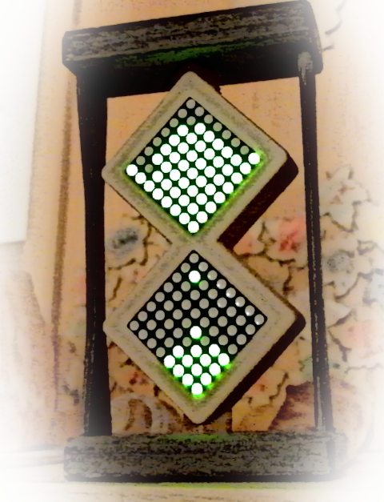

# ESP8266 Hourglass

!

Simple ESP8266 Micropython based electronic hour glass, useful for some table games
or just to learn small children to get feeling how time flows ;-).

## Installation

Installation shall be pretty easy. You just need to flash firmware into your ESP8266 board.
There is many options how to do it, use of [Thonny IDE](https://thonny.org/) is described here.

If you already do not have Thonny IDE installed, you can follow
[this page](https://github.com/thonny/thonny/releases).

1. Run `thonny` and follow menu `Tools -> Options... -> Interpreter`.
2. Choose interpreter `Micropython (ESP8266)`.
3. Click on `Install or update Micropython` in lower right corner.
4. Then select port where your ESP board is connected.
5. Download firmware binary file [esp8266_hourglass.bin](https://github.com/ondiiik/hourglass/releases) from latest releases.
6. Choose downloaded firmware file.
7. Ensure that `Erase flash before installing` check-box is checked to erase actual file system on chip.
   This is needed as this Micropython image is pre-compiled and set up to create necessary files
   on ESP file system required for startup of Python code automatically.
8. Then click on `Install` and wait till firmware is flashed.

### Setup

Use Thonny IDE again to modify `config.py` directly in ESP device.